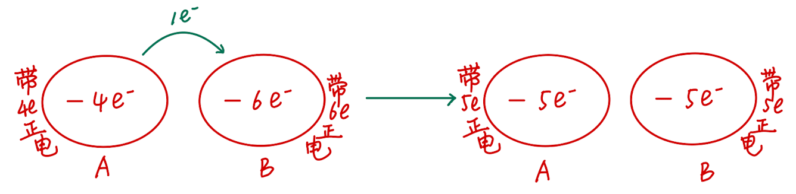

# U1-1 电荷 电荷守恒定律

## 概说

从现在开始，我们要进入高二的物理必修三的学习了。先交代一下我的写作风格吧——

- 正文部分保持严谨准确的风格，但是会尽量用一些比较通俗的语言来表达一些概念。

- 例题部分会使用Admonitions（提示框）来框定题目，并且会在题目下方给出解答。

- 对于正文之外的我的闲话，会以footnotes（脚注）或者简单的“括号”的形式来表达。

- 对于一些补充性的概念，也会使用Admonitions（提示框）来框定概念或以footnotes（脚注）的形式表达。

再来说说物理必修三。必修三主要包括以下几个章节：

- 第一章：静电场

- 第二章：电路及其应用

- 第三章：电磁场与电磁波初步

- 第四章：能源与可持续发展

可以看出来，这本书主要讲电学、电磁场和能源的相关知识。其中，电路及其应用和电磁场与电磁波初步是比较重要的章节，因为它们涉及到我们生活中很多的问题。比如，我们在使用电器的时候，就需要了解电路的原理，这样才能保证我们的电器正常工作。同样，我们在使用电视、手机等电子设备的时候，也需要了解电磁场的原理，这样才能保证我们的电子设备正常工作。最后，能源与可持续发展也作为当前的一个热点话题，也需要我们简单掌握。

好了，现在正式进入物理必修三第一章《静电场》第一节《电荷 电荷守恒定律》的学习吧。

## 电荷

### 我们已知的电荷

在初中，我们已经初步接触过电荷的概念了。我们知道，正电荷是**用丝绸摩擦过的玻璃棒**所带的电荷，而负电荷是**用毛皮摩擦过的橡胶棒**所带的电荷。我们也知道，**同种电荷相互排斥，异种电荷相互吸引。**

如果记性再好一点，我们也会想起来，表示电荷的多少的物理量叫做**电荷量**，简称为**电荷**，单位是**库仑**，用符号 $C$ 表示。通常正电荷的电荷量用正数表示，负电荷的电荷量用负数表示。

对于电荷量的常用单位，我们有以下换算关系：

$$ 1C = 10^6μC (微库) = 10^9nC (纳库)$$

!!! note "元电荷"
    一个电子所带的电荷量的绝对值为 $1.602 \times 10^{-19} C$。称为元电荷，记作： $e = 1.602 \times 10^{-19} C$。它是一种基本单位，因为我们发现任何带电体所带的电荷量都是元电荷的整数倍。（可以类比化学中的阿伏伽德罗常数）

到目前为止，这些内容都是初中物理讲过的“旧知识”。那么，上了高中，我们对电荷的了解就不能停留在这么肤浅的层面了。我们需要了解更多关于电荷的「高级知识」。

### 摩擦起电

由初中化学知识可知（不是说好了高级知识吗），我们知道，物质由原子组成，而原子又由原子核和电子组成。原子核带正电荷，电子带负电荷。通常情况，原子核的正电荷数等于电子的负电荷数。所以物体整体对外不显电性。

在摩擦的过程中，由于不同物体的原子对于外层电子的束缚能力不同，束缚能力差的原子的外层电子会转移到束缚能力强的原子中去。这样，一个物体就**失去了电子**，总核电荷数大于电子电荷数，物体**对外显正电**；另一物体**得到了电子**，电子电荷数大于核电荷数，物体**对外显负电**。并且，由于这个过程中电子的转移局限在相互摩擦的两物体之间，所以摩擦过后两物体所带的电荷必然是**「等量异号」**的。

!!! note "导体和绝缘体"
    导体指容易导电的物质，绝缘体指不容易导电的物质。导体中外层电子容易脱离原子核，在物体内部自由运行，成为自由电子。当这些自由电子开始发生定向移动时，导体内部就形成了电流，电流的方向与自由电子移动的方向相反。绝缘体中原子核束缚能力很强，几乎没有自由电子存在，所以很难形成电流。

## 电荷守恒定律

**因为电荷不能被创造，也不能被消灭，它们只能从一个物体转移到另一个物体，或者从物体的一部分转移到另一个物体。**这就是**电荷守恒定律**的内容。在任何自然过程中，电荷的代数和是守恒的。

电荷守恒定律的内容只有这么多，下面是一道例题。

!!! question "例题"

    完全相同的两金属小球$A$、$B$带有相同的电荷量，相隔一定的距离，今让第三个完全相同的不带电金属小球$C$，先后与$A$、$B$接触后移开。
    
    1. 若$A$、$B$两球带同种电荷，接触后两球的电荷量大小之比为多大？

    2. 若$A$、$B$两球带异种电荷，接触后两球的电荷量大小之比为多大？

先说解法。在计算接触的两材质相同物体的电荷的转移时，其所带的电荷相加（相同电荷直接相加，异种电荷相减），将计算所得的结果取绝对值，就是这两物体的总电荷量，每个物体的电荷量就用总电荷量除以2即可。

想要知道为什么这么计算，我们的视野需要回到微观层面。在两**相同材质**物体接触时，由于两物体原子的原子核对电子的束缚能力相同，外层电子将会在两物体之间**均分**。当两物体同时带正电/负电时，两物体都缺少/富余电子。物体接触、电子均分后，两物体的总电荷量不变，每个物体的电荷量变为原来电荷总量的 $\cfrac 1 2$ 。

如果不好理解，可以参考下面的图。

请注意， $-e^-$ 表示失去一个电子，带一个单位正电。

所以在这道题中，我们不妨设金属小球$A$、$B$都带一个单位的电荷。

对于1问，若$A$、$B$两球带同种电荷，根据电荷守恒定律，我们知道，$A$、$C$两球的总电荷量为 $e$ ，所以第一次接触后，两球的电荷量分别为 $A$ 球： $\cfrac {1} {2} e$ ，$C$ 球： $\cfrac {1} {2} e$ 。 $B$、$C$ 两球的总电荷量为 $\cfrac {3} {2} e$ ，所以第二次接触后，两球的电荷量分别为 $B$ 球： $\cfrac {3} {4} e$ ，$C$ 球： $\cfrac {3} {4} e$ 。

所以1问中，$A$、$B$两球电荷量大小的比值为：

$$\cfrac { \cfrac {1} {2} } { \cfrac {3} {4} } = \cfrac 2 3$$

对于2问，若$A$、$B$两球带异种电荷，根据电荷守恒定律，我们知道，$A$、$C$两球的总电荷量为 $e$ ，所以第一次接触后，两球的电荷量分别为 $A$ 球： $\cfrac {1} {2} e$ ，$C$ 球： $\cfrac {1} {2} e$ 。 $B$、$C$ 两球（异种电荷）的总电荷量为 $\cfrac {1} {2} e$ ，所以第二次接触后，两球的电荷量分别为 $B$ 球： $\cfrac {1} {4} e$ ，$C$ 球： $\cfrac {1} {4} e$ 。

所以2问中，$A$、$B$两球电荷量大小的比值为：

$$\cfrac { \cfrac {1} {2} } { \cfrac {1} {4} } = \cfrac 2 1$$
