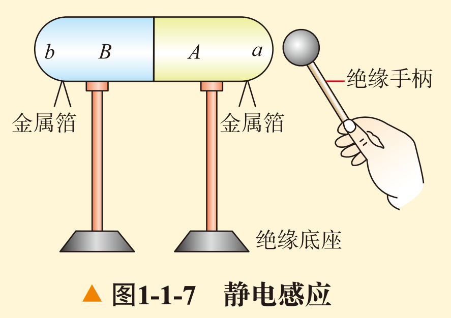

# U1-1 电荷 电荷守恒定律

## 概说

从现在开始，我们要进入高二的物理必修三的学习了。先交代一下我的写作风格吧——

- 正文部分保持严谨准确的风格，但是会尽量用一些比较通俗的语言来表达一些概念。

- 例题部分会使用Admonitions（提示框）来框定题目，并且会在题目下方给出解答。

- 对于正文之外的我的闲话，会以footnotes（脚注）或者简单的“括号”的形式来表达。

- 对于一些补充性的概念，也会使用Admonitions（提示框）来框定概念或以footnotes（脚注）的形式表达。

再来说说物理必修三。必修三主要包括以下几个章节：

- 第一章：静电场

- 第二章：电路及其应用

- 第三章：电磁场与电磁波初步

- 第四章：能源与可持续发展

可以看出来，这本书主要讲电学、电磁场和能源的相关知识。其中，电路及其应用和电磁场与电磁波初步是比较重要的章节，因为它们涉及到我们生活中很多的问题。比如，我们在使用电器的时候，就需要了解电路的原理，这样才能保证我们的电器正常工作。同样，我们在使用电视、手机等电子设备的时候，也需要了解电磁场的原理，这样才能保证我们的电子设备正常工作。最后，能源与可持续发展也作为当前的一个热点话题，也需要我们简单掌握。

好了，现在正式进入物理必修三第一章《静电场》第一节《电荷 电荷守恒定律》的学习吧。

## 电荷

### 我们已知的电荷

在初中，我们已经初步接触过电荷的概念了。我们知道，正电荷是**用丝绸摩擦过的玻璃棒**所带的电荷，而负电荷是**用毛皮摩擦过的橡胶棒**所带的电荷。我们也知道，**同种电荷相互排斥，异种电荷相互吸引。**

如果记性再好一点，我们也会想起来，表示电荷的多少的物理量叫做**电荷量**，简称为**电荷**，单位是**库仑**，用符号 $C$ 表示。通常正电荷的电荷量用正数表示，负电荷的电荷量用负数表示。

对于电荷量的常用单位，我们有以下换算关系：

$$ 1C = 10^6μC (微库) = 10^9nC (纳库)$$

!!! note "元电荷"
    一个电子所带的电荷量的绝对值为 $1.602 \times 10^{-19} C$。称为元电荷，记作： $e = 1.602 \times 10^{-19} C$。它是一种基本单位，因为我们发现任何带电体所带的电荷量都是元电荷的整数倍。（可以类比化学中的阿伏伽德罗常数）

到目前为止，这些内容都是初中物理讲过的“旧知识”。那么，上了高中，我们对电荷的了解就不能停留在这么肤浅的层面了。我们需要了解更多关于电荷的「高级知识」。

### 摩擦起电

由初中化学知识可知（不是说好了高级知识吗），我们知道，物质由原子组成，而原子又由原子核和电子组成。原子核带正电荷，电子带负电荷。通常情况，原子核的正电荷数等于电子的负电荷数。所以物体整体对外不显电性。

在摩擦的过程中，由于不同物体的原子对于外层电子的束缚能力不同，束缚能力差的原子的外层电子会转移到束缚能力强的原子中去。这样，一个物体就**失去了电子**，总核电荷数大于电子电荷数，物体**对外显正电**；另一物体**得到了电子**，电子电荷数大于核电荷数，物体**对外显负电**。并且，由于这个过程中电子的转移局限在相互摩擦的两物体之间，所以摩擦过后两物体所带的电荷必然是**「等量异号」**的。

!!! note "导体和绝缘体"
    导体指容易导电的物质，绝缘体指不容易导电的物质。导体中外层电子容易脱离原子核，在物体内部自由运行，成为自由电子。当这些自由电子开始发生定向移动时，导体内部就形成了电流，电流的方向与自由电子移动的方向相反。绝缘体中原子核束缚能力很强，几乎没有自由电子存在，所以很难形成电流。

## 电荷守恒定律

**因为电荷不能被创造，也不能被消灭，它们只能从一个物体转移到另一个物体，或者从物体的一部分转移到另一个物体。**这就是**电荷守恒定律**的内容。在任何自然过程中，电荷的代数和是守恒的。

电荷守恒定律的内容只有这么多，下面是一道例题。

!!! question "例题"

    完全相同的两金属小球$A$、$B$带有相同的电荷量，相隔一定的距离，今让第三个完全相同的不带电金属小球$C$，先后与$A$、$B$接触后移开。
    
    1. 若$A$、$B$两球带同种电荷，接触后两球的电荷量大小之比为多大？

    2. 若$A$、$B$两球带异种电荷，接触后两球的电荷量大小之比为多大？

先说解法。在计算接触的两材质相同物体的电荷的转移时，其所带的电荷相加（相同电荷直接相加，异种电荷相减），将计算所得的结果取绝对值，就是这两物体的总电荷量，每个物体的电荷量就用总电荷量除以2即可。

想要知道为什么这么计算，我们的视野需要回到微观层面。在两**相同材质**物体接触时，由于两物体原子的原子核对电子的束缚能力相同，外层电子将会在两物体之间**均分**。当两物体同时带正电/负电时，两物体都缺少/富余电子。物体接触、电子均分后，两物体的总电荷量不变，每个物体的电荷量变为原来电荷总量的 $\cfrac 1 2$ 。

如果不好理解，可以参考下面的图。

请注意， $-e^-$ 表示失去一个电子，带一个单位正电。

所以在这道题中，我们不妨设金属小球$A$、$B$都带一个单位的电荷。

对于1问，若$A$、$B$两球带同种电荷，根据电荷守恒定律，我们知道，$A$、$C$两球的总电荷量为 $e$ ，所以第一次接触后，两球的电荷量分别为 $A$ 球： $\cfrac {1} {2} e$ ，$C$ 球： $\cfrac {1} {2} e$ 。 $B$、$C$ 两球的总电荷量为 $\cfrac {3} {2} e$ ，所以第二次接触后，两球的电荷量分别为 $B$ 球： $\cfrac {3} {4} e$ ，$C$ 球： $\cfrac {3} {4} e$ 。

所以1问中，$A$、$B$两球电荷量大小的比值为：

$$\cfrac { \cfrac {1} {2} } { \cfrac {3} {4} } = \cfrac 2 3$$

对于2问，若$A$、$B$两球带异种电荷，根据电荷守恒定律，我们知道，$A$、$C$两球的总电荷量为 $e$ ，所以第一次接触后，两球的电荷量分别为 $A$ 球： $\cfrac {1} {2} e$ ，$C$ 球： $\cfrac {1} {2} e$ 。 $B$、$C$ 两球（异种电荷）的总电荷量为 $\cfrac {1} {2} e$ ，所以第二次接触后，两球的电荷量分别为 $B$ 球： $\cfrac {1} {4} e$ ，$C$ 球： $\cfrac {1} {4} e$ 。

所以2问中，$A$、$B$两球电荷量大小的比值为：

$$\cfrac { \cfrac {1} {2} } { \cfrac {1} {4} } = \cfrac 2 1$$

## 静电感应

首先，关于书上的实验，推荐大家去b站搜索相关视频先看一遍。

[点击观看静电感应实验视频](https://www.bilibili.com/video/BV1L7411c7v4/){ .md-button }

静电感应是指当一个带电体靠近一个不带电的导体时，导体内部的电子会受到带电体的影响而发生定向移动，从而使导体的一部分带正电，另一部分带负电。这个现象就是静电感应。

在这个实验中，当我们把带正电的小球靠近枕形导体的 $a$ 端，电子将会重新分布，$a$ 端显负电，$b$ 端显正电。

当把 $a$ 、 $b$ 两端分开以后，再移开带电的球，由于 $a$ 、 $b$ 两端不再导通，所以电荷无法重新排布，两端依旧显电性。

合拢分开的 $a$ 、 $b$ 两端后，电荷重新分布均匀，两端均不带电。

### 验电器相关实验

验电器的结构初中已经学过，这里我们说它的两种用法。

1. 检测物体是否带电。

    - 当物体带电时，将物体靠近验电器上端金属小球，发生静电感应，下端金属箔带上与物体同种的电荷，箔片张开。

2. 检测物体带电的正负性

    - 先使用带正电的物体接触小球，让其间电荷发生转移，验电器就带上了正电。此时移开带正电的物体，箔片不闭合。

    - 再使用带检验的带电体靠近金属小球，若物体带正电，根据静电感应的原理，金属箔将带更多正电，张开角度变大；反之，若物体带负电，金属箔将带更少正电，张开角度将减小。

??? question "自我评价（课后习题）"

    1.甲、乙两个金属小球相互作用。已知甲球带正电荷，在下面两种情况下，判断乙球是否带电，如果带电，带哪种电荷？

    （1）两小球相互排斥；

    （2）两小球相互吸引。

        解答：（1）乙球带正电（2）乙球带负电

    2.不带电的金属导体A与带正电的金属导体B接触之后也带正电，原因是（   ）

    A. B有部分正电荷转移到A上 B. A有部分正电荷转移到B上

    C. A有部分电子转移到B上   D. B有部分电子转移到A上

        解答：C。正电荷即为质子，不发生转移，发生转移的只能是负电荷（电子）。

    3.如图1-1-7所示，带电小球靠近（不接触）枕形导体的一端，下面的金属箔片都张开，这种现象叫作“静电感应”，而不能叫作“感应起电”，为什么？

        解答：静电感应是指，在外部带电体的作用下，导体内部电子发生移动，根据“同性相斥，异性相吸”的原理重新排布，使得导体不同部分电性不同的现象。静电感应现象中导体所带的总电荷不变，只是发生了重新排布。起电的意思是，导体内部的电荷转移到外部，使得导体整体总电荷量发生了改变。所以不能称为感应起电。

    4.使18世纪电学家们感到困惑的一个现象是所谓的“吸引—接触—排斥”现象：将带电棒移近一悬挂在绝缘线上的轻质导体小球，可观察到球被吸引，若小球与棒接触后，它就立即被弹开。你如何解释这一现象？

        解答：吸引过程中，由于“带电体可以吸附轻小物体的性质，小球被吸引。接触时，根据电荷守恒定律，两物体都带上了同种电荷。排斥过程，即为转移后两同性物体相斥的过程。

这一节终于结束了。有遗漏或疏忽的地方请到下方博客评论区指正。

[点击前往博客页面](https://blog.howcam.top/2025/07/07/%E5%BC%80%E6%96%B0%E5%9D%91%E5%95%A6/){ .md-button }